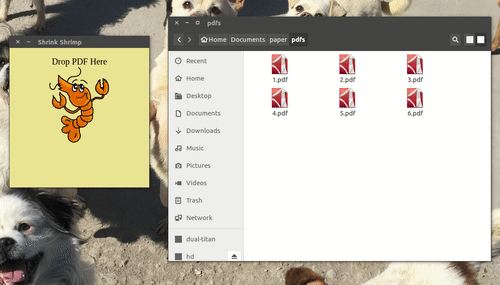

# Shrink Shrimp #

**Batch shrink scanned PDFs, a Electron GUI wrapper for GhostScript**

[中文版说明点这里](README_CN.md)

## Showcase ##

## Download ##

**Current Version 0.1.0**

* [Windows 64bit](https://github.com/bclicn/shrink-shrimp/releases/download/0.1.0/shrink_shrimp-0.1.0-win32-x64.rar)
* [OSX](https://github.com/bclicn/shrink-shrimp/releases/download/0.1.0/shrink_shrimp-0.1.0-darwin.zip)
* [Linux 64bit](https://github.com/bclicn/shrink-shrimp/releases/download/0.1.0/shrink_shrimp-0.1.0-linux-x64.tar.gz)

Or visit [Release Page](https://github.com/bclicn/shrink-shrimp/releases).

## Use ##

1. __Drag & Drop__ one or multiple PDFs to the __Shrimp__
2. Wait for the process to finish
3. Shrinked PDFs would be in the same directory with the prefix of __shrink__
4. Click the shrimp icon at the bottom right to reset
5. If you encounter errors, hover on the records to see details

__Note:__  You would need to pre-install `GhostScript` on __OSX__ and __Ubuntu__ in order to use this app. You __DO NOT__ have to pre-install
GhostScript on Windows.

* __OSX:__ `brew install ghostscript`
* __Ubuntu:__ `sudo apt-get install ghostscript` (addtinal mirror might be required)

## Develop ##

Assume you have `node 10+` and `npm` installed

    cd /to/some/dir/
    git clone https://github.com/bclicn/shrink-shrimp.git

    cd shrink-shrimp

    // for chinese users
    npm install -g mirror-config-china --registry=http://registry.npm.taobao.org

    npm install
    npm start

## Build ##

Follow the steps in __Develop__ then

    // on Windows 64bit
    npm run build-win

    // on OSX
    npm run build-mac
    
    // on Linux
    npm run build-lin

__Note:__ after building on Windows, you can download [gs-926-win32-x64.zip](https://github.com/bclicn/shrink-shrimp/releases/download/0.1.0/gs-926-win32-x64.zip), then copy `gsdll64.dll` and `gs.exe` to the directory of `shrink_shrimp.exe`

## Bug ##

Please use [Issue Tab](https://github.com/bclicn/shrink-shrimp/issues) if you encounter a bug.

## License ##
[MIT](LICENSE)

